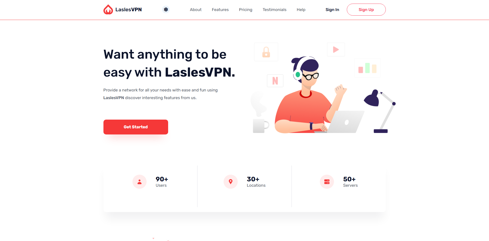

# 🌐 LaslesVPN - Modern Landing Page

A sleek, responsive VPN service landing page built as a training project. This project focuses on mastering modern CSS layout techniques including **SASS**, **CSS Grid**, and **Flexbox**.

 

## 🚀 Project Overview

The goal of this project was to translate a high-fidelity design into a functional, responsive web page. It showcases a clean user interface with features like pricing tables, testimonials, and a global network map.

### Key Features:
*   **Fully Responsive:** Optimized for desktop, tablet, and mobile views.
*   **Modern Layouts:** Utilizes a mix of CSS Grid for page structure and Flexbox for component alignment.
*   **SASS Workflow:** Organized style architecture using variables, nesting, and mixins for maintainable code.
*   **Performance:** Lightweight and fast-loading with clean HTML5 markup.

---

## 🛠️ Built With

*   **HTML5** - Semantic structure.
*   **CSS3** - Custom styling and animations.
*   **SASS/SCSS** - Advanced styling and modularity.
*   **Flexbox & CSS Grid** - Responsive positioning.

---

## 📸 Screenshots

| Desktop View | Mobile View |
| :--- | :--- |
|  |  |

*(Pro-tip: Create a folder named `assets/screenshots` in your repo and add your images there!)*

---

## ⚙️ How to Run This Project

1.  **Clone the repository:**
    ```bash
    git clone [https://github.com/your-username/lasles-vpn.git](https://github.com/your-username/lasles-vpn.git)
    ```
2.  **Navigate to the project folder:**
    ```bash
    cd lasles-vpn
    ```
3.  **Open the project:**
    Simply open `index.html` in your favorite browser, or use the **Live Server** extension in VS Code.

---

## 🧠 What I Learned

While building LaslesVPN, I strengthened my skills in:
*   Implementing **complex grid layouts** that shift based on screen size.
*   Using **SASS variables** to manage a consistent color palette and typography.
*   Creating interactive elements like hover states and smooth transitions.

---

## 👤 Author

**Your Name**
*   GitHub: [@your-username](https://github.com/your-username)
*   LinkedIn: [Your Name](https://linkedin.com/in/your-profile)

---

### 📝 License
This project is for educational purposes. Feel free to use the code for your own learning!
